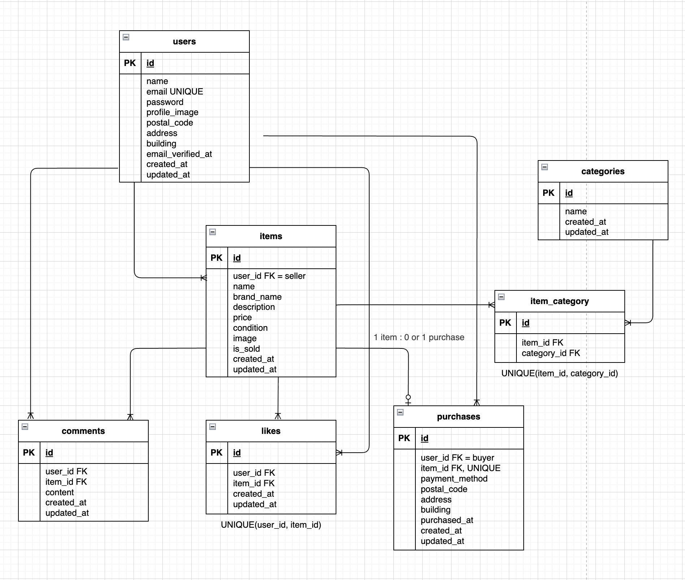
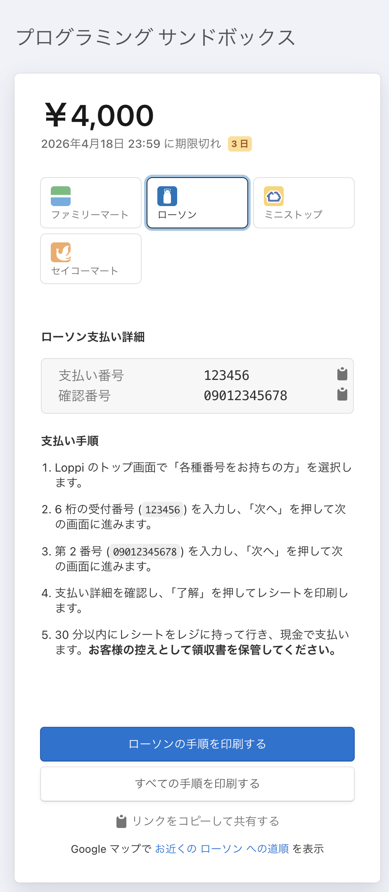

# coachtech-furima

## アプリ概要

Laravelを使用して作成したフリマアプリです。
ユーザーは商品一覧の閲覧、商品詳細の確認を行うことができます。
会員登録およびログイン後には、商品一覧の閲覧、商品詳細の確認、商品出品、プロフィール編集を行うことができます。
いいねを押した商品をマイリストに表示したり、マイページで出品／購入した商品の確認を行うことができます。
商品画像およびプロフィール画像のアップロードにも対応しています。

---

## 環境構築

### Dockerビルド

```bash
git clone https://github.com/kajihata-rumi/coachtech-furima.git
cd coachtech-furima
docker-compose up -d --build

```

### Laravel環境構築

```bash
docker-compose exec php bash
composer install
cp .env.example .env
```

`.env` を設定後、以下を実行してください。

```bash
php artisan key:generate
php artisan migrate --seed
php artisan storage:link
```

---

## .env 設定

`.env.example` を `.env` にコピーした後、以下を設定してください。
`DB_HOST=127.0.0.1` のままだと Docker 環境で接続できません。

```env
DB_CONNECTION=mysql
DB_HOST=mysql
DB_PORT=3306
DB_DATABASE=laravel_db
DB_USERNAME=laravel_user
DB_PASSWORD=laravel_pass

MAIL_MAILER=smtp
MAIL_HOST=mailhog
MAIL_PORT=1025
MAIL_USERNAME=null
MAIL_PASSWORD=null
MAIL_ENCRYPTION=null
MAIL_FROM_ADDRESS=test@example.com
MAIL_FROM_NAME="${APP_NAME}"

APP_URL=http://localhost

STRIPE_KEY=ご自身の公開キー
STRIPE_SECRET=ご自身のシークレットキー
```

※ Stripeのキーは各自で取得したテスト用キーを設定してください。

---

## Seederについて

動作確認用としてSeederで初期データを登録しています。
商品一覧・商品詳細・いいね・コメント・購入機能などの確認に使用できます。

### 登録内容

- ユーザー3名
  - testuser1
    - email: `testuser1@example.com`
    - password: `password`
    - 認証済み
    - 住所あり

  - testuser2
    - email: `testuser2@example.com`
    - password: `password`
    - 認証済み
    - 住所なし

  - testuser3
    - email: `testuser3@example.com`
    - password: `password`
    - 未認証

- 商品データ10件
  - 腕時計
  - HDD
  - 玉ねぎ3束
  - 革靴
  - ノートPC
  - マイク
  - ショルダーバッグ
  - タンブラー
  - コーヒーミル
  - メイクセット

### 補足

- 新規ユーザーを作成した場合も機能は動作します。
- 新規ユーザーに紐づく出品データ・購入データがない場合、マイページの一覧は空表示になります。

--

## 使用技術（実行環境）

- PHP 8.1
- Laravel 8.83.29
- MySQL 8.0
- nginx 1.21.1
- Docker
- Docker Compose
- MailHog

## 外部サービス

- Stripe

---

## ER図



---

## URL

- 開発環境: http://localhost/
- phpMyAdmin: http://localhost:8080/
- MailHog: http://localhost:8025/

---

## 主な機能

### 実装済み内容

- 会員登録
- ログイン
- ログアウト
- メール認証
- 商品検索
  - 部分一致検索
- 商品一覧
  - おすすめ表示
  - マイリスト表示
  - Sold表示
  - 商品詳細へ
- 商品詳細表示
  - いいね追加 / 解除
  - 商品購入手続きへ
  - 商品説明
  - 商品の情報
  - 商品の状態
  - コメント表示
  - コメント送信
- 商品購入手続き
  - 支払い方法選択
  - 配送先表示・変更
  - 購入後Stripe遷移（決済画面へ）
  - カードで購入完了時に成功メッセージを表示
- 商品出品
  - 商品画像アップロード
  - 商品カテゴリー：14種類から選択
  - 商品の状態：４種類から選択
  - 商品名
  - ブランド名
  - 商品の説明
  - 販売価格
  - 出品完了時に成功メッセージを表示
- プロフィール編集
  - プロフィール画像アップロード
  - ユーザー名
  - 郵便番号
  - 住所
  - 建物名
  - 更新完了時に成功メッセージを表示
- マイページ表示
  - プロフィール画像
  - ユーザー名
  - 出品した商品一覧
  - 購入した商品一覧

---

## メール認証確認手順

本アプリではメール認証機能を実装しています。
メール送信確認には MailHog を使用します。

確認手順

- 会員登録を行う
- MailHog（http://localhost:8025/）にアクセスする
- 認証メールを確認する
- メール内の認証URLをクリックする
- メール認証完了後、プロフィール設定画面へ遷移することを確認する

---

## Stripe決済機能について

本アプリでは Stripe を利用した決済機能を実装しています。

### テスト用カード支払い

以下のテストカード番号を使用してください。

- カード番号: 4242 4242 4242 4242
- 有効期限: 任意の未来日
- CVC: 任意の3桁
- 郵便番号: 任意

カード支払い選択時は以下の挙動になります。

- 「購入する」ボタン
- Stripeへ遷移する
- カード支払い完了後自動で商品一覧に戻る
- 商品一覧で完了メッセージが表示される
- 商品一覧で Sold 表示になる
  
- マイページの「購入した商品」タブへ反映される

### テスト用コンビニ払い

実際の仕様では、コンビニでの店頭支払い完了後、確認が取れてから（タイムラグがあって）購入済みとして扱われます。
一方、本模擬案件では Stripe のコンビニ決済画面への遷移確認が要件となっているため、アプリ側では購入導線の確認を優先し、Stripeへ遷移する前に purchases テーブルへ保存される実装としています。

そのため、コンビニ払い選択時は以下の挙動になります。

- 「購入する」ボタン
- Stripeへ遷移する前にDB（purchases テーブル）へ保存される
- 商品一覧で Sold 表示になる
- マイページの「購入した商品」タブへ反映される
- Stripeのコンビニ支払い画面へ遷移する
  

* Stripeのコンビニ支払い画面からアプリへ自動で戻らないため、商品一覧での完了メッセージは表示されません。
* 手動で一覧画面に戻ってから、マイページの「購入した商品」タブへの反映を確認してください。

---

## カテゴリについて

カテゴリ情報は仕様書の商品データ一覧に記載がなかったため、
UI仕様書にある14種類から任意で紐付けています。

---

## 画像アップロード機能について

- 画像選択時のプレビューは実装していません。
- 登録後の画面で確認してください。

### 商品画像アップロード

- 出品時に商品画像をアップロードできるように実装しています。
- 商品画像は storage/app/public/items に保存しています。
- 保存した画像は、商品一覧画面およびマイページで表示確認済みです。

### プロフィール画像アップロード

- プロフィール編集画面でプロフィール画像をアップロードできるように実装しています。
- プロフィール画像は storage/app/public/profiles に保存しています。
- 保存した画像は、プロフィール編集画面およびマイページで表示確認済みです。

### 補足

画像表示には以下のコマンドが必要です。

```bash
php artisan storage:link
```

---

### バリデーション実装ファイル

- 会員登録時: src/app/Http/Requests/RegisterRequest.php
- ログイン時: src/app/Http/Requests/Auth/LoginRequest.php
- コメント時: src/app/Http/Requests/CommentRequest.php
- 配送先入力時: src/app/Http/Requests/Auth/PurchaseRequest.php
- 住所変更時: src/app/Http/Requests/Auth/AddressRequest.php
- プロフィール登録時: src/app/Http/Requests/Auth/ProfilesRequest.php
- 商品登録時: src/app/Http/Requests/ExhibitionRequest.php

---

## PHPUnit Featureテスト

Featureテストは以下のコマンドで実行できます。

```bash
php artisan test
```

### 今回作成した主なFeatureテスト

- 会員登録機能 → `RegisterTest.php`
- ログイン機能 → `LoginTest.php`
- ログアウト機能 → `LogoutTest.php`
- 商品一覧取得 → `ItemListTest.php`
- マイリスト一覧取得 → `MylistIndexTest.php`
- 商品検索機能 → `ItemSearchTest.php`
- 商品詳細情報取得 → `ItemDetailTest.php`
- いいね機能 → `LikeToggleTest.php`
- コメント送信機能 → `CommentTest.php`
- 商品購入機能 → `PurchaseFlowTest.php`
- 支払い方法選択機能 → `PurchasePaymentMethodTest.php`
- 配送先変更機能 → `PurchaseAddressChangeTest.php`
- ユーザー情報取得 → `UserProfileTest.php`
- ユーザー情報変更 → `ProfileUpdateTest.php`
- 出品商品情報登録 → `SellItemTest.php`
- メール認証機能 → `EmailVerificationFlowTest.php`

※ 上記の機能ごとに、正常系・異常系・バリデーションを含むFeatureテストを実施しています。
